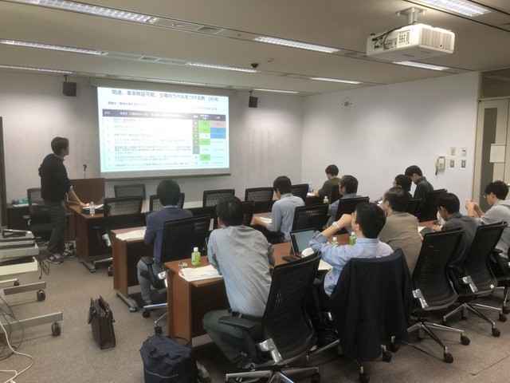

[Top page](https://poliinfo.github.io)

11月26日より行われるFormal Runに向けて、  
NTCIR-14 QALab-PoliInfo 第４回説明会を10月29日（月）に開催いたしました。  

## Slides
- [4th Round Table Meeting (Oct 29, 2018)](/NTCIR-14-QALab-PoliInfo-4thRoundTableMTG.pdf)

--------------------------------------------------

<strong> NTCIR-14 QALab-PoliInfo 第4回説明会 </strong>

　日時：10月29日（月）　15:00-18:00  
　場所：国立情報学研究所 (room 1901･1902)  

ウェブサイト:　https://poliinfo.github.io/   
お問い合わせは　qalab-admin@nii.ac.jp　まで   

--------------------------------------------------

NTCIR-14 QALab-PoliInfoでは、地方議会会議録を対象として、Segmentation、Summarization、Classificationの３タスクを行います。  

第４回説明会では、Dry Run（予備Run）からの変更点や、Formal Run用のトレーニングデータなどを説明しました。
Formal Runのスケジュールは以下の通りで、今からの参加者を歓迎しております。

Formal Run 参加登録〆切: 11月19日（月）　※Dry Run参加者は登録不要  
Formal Run: 11月26日（月）～  

皆様お誘い合わせの上、奮ってご参加下さいますようお願い申し上げます。  

Organizers:
- 神門典子（国立情報学研究所, 総合研究大学院大学）
- 石下円香（国立情報学研究所）
- 三田村照子（カーネギーメロン大学）
- 木村泰知（小樽商科大学, 理化学研究所AIP）
- 渋木英潔（横浜国立大学）
- 阪本浩太郎（横浜国立大学, 国立情報学研究所）
- 高丸圭一(宇都宮共和大学)
- 内田ゆず(北海学園大学)
- 乙武北斗(福岡大学)

Advisers:
- 森辰則（横浜国立大学）
- 湯淺墾道（情報セキュリティ大学院大学）
- 関根聡（理化学研究所AIP）
- 乾健太郎（東北大学, 理化学研究所AIP）
