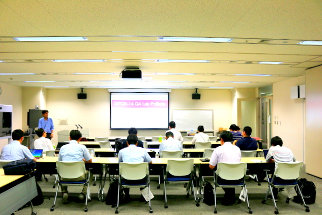
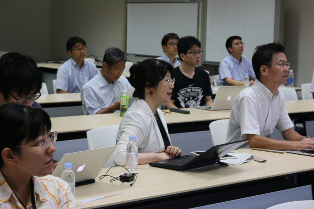
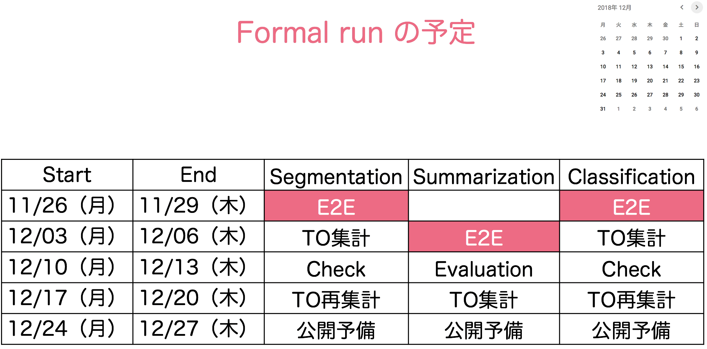

---
# Edit theme's home layout instead if you wanna make some changes
# See: https://jekyllrb.com/docs/themes/#overriding-theme-defaults
layout: default
---
# [](#whats-new)What's New


* [The result of Formal Run](https://poliinfo.github.io/FormalRunResult) was released on Feb 18, 2019
* [The 4th round table meeting](https://poliinfo.github.io/4th_round_table_meeting) was be held on Oct 29, 2018
    * [4th Round Table Meeting Slides(PDF,6MB)](/NTCIR-14-QALab-PoliInfo-4thRoundTableMTG.pdf)  
* [The 3rd round table meeting](https://poliinfo.github.io/3rd_round_table_meeting) was held on Aug 30, 2018
* [Training data for Dry Run](http://local-politics.jp/?page_id=1035) was released on June 19, 2018
* [The 2nd round table meeting](https://poliinfo.github.io/2nd_round_table_meeting) was held on May 31, 2018
* Released the website to the public, Dec. 21, 2017

See [update history](https://github.com/PoliInfo/PoliInfo.github.io/commits/master)




# [](#overview)Overview

The goal of the QA Lab-PoliInfo (Question Answering Lab for Political Information) task at NTCIR 14 is aimed at complex real-world question answering (QA) technologies, to show summaries on the opinions of assemblymen, and the reasons and conditions for such opinions, from Japanese regional assembly minutes. 

We reaffirm the importance of fact checking owing to the negative impact of fake news in recent years.
For example, the International Fact-Checking Network of the Poynter Institute established that April 2 would be considered as [International Fact-Checking Day](http://factcheckingday.com/) from 2017.
In addition, fact-checking is difficult for general Web search engines to deal with because of the ‘filter bubble’ developed by Eli Pariser, which keeps users away from information that disagrees with their viewpoints.
For fact checking, we should confirm the primary sources such as the assembly minutes.
The description of Japanese assembly minutes is a transcript of a speech, which is very long (see the [example](#transcript)). Therefore, it is difficult to understand the contents, including the opinions of the assemblymen at a glance.
New information access technologies to support user understanding are expected, which would thus protect us from fake news.

We provide the Japanese Regional Assembly Minutes Corpus as the training and test data, and investigate appropriate evaluation metrics and methodologies for the structured data as a joint effort of the participants.

QA using Japanese regional assembly minutes has the following challenges to consider:
1. Comprehensible summary of a topic,
2. Beliefs and attitudes of assemblymen,
3. Mental spaces for other assemblymen,
4. Contexts, including reasons,
5. Several topics in a speech,
6. Colloquial Japanese including dialect and slang.  

In addition to QA technologies, this task will contribute to the development of a semantic representation, context
understanding, information credibility, automated summarization, and dialog systems.

# [](#task)Task

At this time, only Japanese task will be conducted.
However, if English data and the organizers are found, English task will also be conducted.

Segmentation task、Summarization task、Classification taskの３通りのタスクを行う。


### Segmentation Task

Segmentation Taskでは、ある議員の議会会議録中の「発言」とその発言の「引用」の組が与えられる。
参加者は、引用に書かれた内容に関連する、発言中の一連の記述（文列）を抽出する。
本タスクは、Summarization taskにつながる要約対象範囲を特定することに相当する。

Segmentation taskは、新聞記事やマイクロブログなどにおいて「A議員は〇〇と主張した」といった二次情報（本タスクの「引用」が該当）に対して、発言したとされる一次情報（本タスクの「発言」が該当）の該当範囲を提示することを目的としている。
引用における問題には、発言の一部が欠落することにより、発言者の本来の意図とは異なった印象を読者に与えてしまう場合がある。
例えば、「*Xのためには*〇〇をすべきだ」、「*Yだとしたら*〇〇をすべきだ」、「*Zなどの*〇〇をすべきだ」といった発言に対して、単に「〇〇をすべきだ」と引用された場合、読者に「（いかなる状況においても）〇〇すべきだ」といった誤解を与えかねない。
そのような問題を解決するために、引用の内容を正確に理解するために読むべき一次情報の範囲を提示することが必要であり、本タスクはそれに該当する。
また、発言者の意図を正確に伝えるための文脈とは何かについても本タスクで議論したい。

* Input:  議会会議録中の「発言」とその発言の「引用」

* Output:  引用を正確に理解するために読むべき発言中の記述（文列）

#### 引用の例
認知症対策  
体制整備は都政の最重要課題の一つ。知事の更なるリーダーシップを。  

#### [](#transcript) 発言の例
260618_304,初めに、認知症対策について質問いたします。  
260618_305,都の最新の推計によれば、何らかの認知症状がある高齢者は、現在都内で約三十八万人おられ、十一年後の二〇二五年には約六十万人、実に高齢者人口の約二割まで急増するとされています。  
260618_306,認知症は、脳の器質障害により、社会生活の基本となる認知機能が低下する疾患であり、患者本人はもとより、家族や地域社会にも広く影響を及ぼす、超高齢時代特有のすぐれて今日的な疾患といえます。  
260618_307,今後は、単身や夫婦のみの高齢者世帯の増加も加速することなどから、患者や介護する家族が安心して暮らし続けることができる体制の整備は都政の最重要課題の一つです。  
260618_308,都は、平成十九年度に認知症対策推進会議を設置し、国に先駆けてさまざまな施策を実施してきたことは評価いたしますが、東京を世界一の福祉先進都市にするには、舛添知事のさらなるリーダーシップが求められます。  
260618_309,ご所見をお伺いいたします。  
260618_310,次に、認知症の高齢者行方不明問題についてであります。  
260618_311,先日、全国の警察が把握した認知症の行方不明高齢者の届け出が、昨年一年間で一万人を超え、都内でも三百八人の届け出があったとの報道がありました。  
260618_312,認知症の方が徘回等で行方不明になった場合、家族は警察に捜索依頼を行います。  
260618_313,また、警察は、身元不明者を保護した場合、二十四時間以内に地元区市町村へ引き継ぐことになっています。  
260618_314,都は現在、区市町村からの依頼に基づき、家族から捜索依頼のあった行方不明者や、警察から引き継がれた身元不明者の情報を区市町村や近隣県に情報提供し、発見に役立ててもらう取り組みを行っています。  
260618_315,今後、ますます認知症による行方不明者はふえるものと懸念されます。  
260618_316,ご家族の苦しみを少しでも軽減するため、都は積極的に情報を掌握し、より広域的に情報を共有できるシステムを整備すべきです。  
260618_317,見解を求めます。  
260618_318,次に、認知症の患者とその家族を支える地域の対応力の向上についてであります。  
260618_319,杉並区にある浴風会病院は、都の認知症疾患医療センターの一つとして、診断を初め、専門相談や地域における医療と介護の連携づくりなど、さまざまな取り組みを行っています。  
260618_320,また、早期発見、診断のため、アウトリーチの取り組みも昨年度から実施しています。  
260618_321,直接スタッフの方からお話を伺いましたが、医師や看護師、精神保健福祉士等から成る専門職のチームが、病院を受診したがらない高齢者の方の自宅を一軒一軒訪問し、早期の受診や支援につなげておられるとのことでした。  
260618_322,また、コーディネーターを初めとする地域関係者の認知症に対する理解が鍵ともいわれていました。  
260618_323,こうした先進的な取り組みは都内の各地域に広げていくべきですが、そのためには、医療機関や地域包括支援センターなどの関係機関や認知症コーディネーターを初めとする地域の関係者の対応力を向上させ、連携を強化させていく必要があると考えます。  
260618_324,見解を求めます。  
260618_325,こうしたこととあわせ、一般都民の理解を深めることもまた重要です。  
260618_326,先ほど指摘した行方不明問題についても、近隣住民や商店街など地域の人たちが認知症に関し幅広く理解していれば、早目に気がつき、声をかけ、保護することも可能となります。  
260618_327,地域社会全体で患者や家族を支えていく取り組みが重要となってまいりますが、都の見解を求めます。  
260618_328,この課題の最後に、認知症医療の充実について伺います。  
260618_329,これまで指摘してきたとおり、認知症患者や家族の支援は非常に多岐にわたりますが、やはり重要なのは、適切な診断、治療を受けられる医療体制の確立です。  
260618_330,この点、都立松沢病院は、認知症疾患医療センターであり、都内では数少ない専門医療を行う入院病棟を備えております。  
260618_331,患者から目を離せない認知症の介護は、家族にとって身体的にも精神的にも大きな負担であり、適切な入院治療に期待するところは大きいものがあります。  
260618_332,都全域を対象に精神科の専門医療を提供する都立松沢病院において、認知症医療の充実を図るべきと考えますが、見解を求めます。  


### Summarization Task

Summarization Taskでは、ある議員の議会会議録中の「発言」と要約の「制限文字数」が与えられる。
参加者は、発言中の「意見」、「根拠」、「条件」、「例示」などが一読して分かるような要約を作成する。
本タスクの特徴は、「発話者の意図を歪めない引用（要約）」を目的としていることである。

一般的な要約では従属節などが削除される傾向にあるが、例えば、「*Xのためには*〇〇をすべきだ」、「*Yだとしたら*〇〇をすべきだ」、「*Zなどの*〇〇をすべきだ」といった発言の要約において、*X*や*Y*や*Z*の記述を削除することは「（いかなる状況においても）〇〇すべきだ」といった誤解を読者に与えかねない。
従って、Summarization Taskでは、このような誤解を招かないように制限字数内に収めることが求められる。
また、正しい理解に必要な文脈が欠落しない要約とは何かについても議論したい。

* Input: 議会会議録中の「発言」と要約の「制限字数」

* Output: 意見、根拠、条件、例示など（発話者の意図）が明瞭に伝わる「要約」


### Classification Task

Classification taskでは、ある政策（〇〇を推進すべき、廃止すべき等）と、その政策そ示すキーワードを含む議会会議録中の「発言（一文）」が与えられる。
参加者は、その発言が政策に対して「賛成（support）」、「反対（against）」、「その他（other）」のどの関係であるかに分類する。

フェイクニュースなどを鵜呑みにしないためには批判的思考（critical thinking）をもつことが重要であり、そのためには、根拠(evidence)に基づいた議論をすることが必要である。
したがって、本タスクでは、議論を行う上で有益な根拠を伴う発言のみを対象として賛成/反対の分類を行う。
すなわち、根拠を伴わない賛成/反対はその他に分類される。

議論を行う上で有益な根拠とは何かを考える場合、以下の点を考慮する必要がある。
政治の議論においては、根拠となる内容が必ずしも賛成/反対の立場を決定づけるわけではない。
例えば、ある政策を実現するために「100万円の費用がかかる」とした場合、それを根拠として「100万円しかかからないので賛成だ」と主張することもできるし、「100万円もかかるので反対だ」と主張することもできる。
したがって、主張する意見が根拠から適切（論理的）に導き出されているかではなく、根拠となる内容が事実であるか否かに政治議論の焦点を当てたい。
以上から、本タスクでは、有益な根拠を第三者が事実検証(fact check)可能なものと限定した。

Web上の意見を賛否の観点から俯瞰する取り組みとしてWISDOMや言論マップなどが存在しているが、これらはWeb上で個別に述べられた意見を集約・俯瞰するのに対し、本タスクでは事実検証可能な根拠を伴う賛成/反対に焦点を当てている点に特徴がある。
また、本タスクの分類が批判的思考を支援するのに十分であるかについても議論したい。

* Input: 政策を示すキーワードを含む、議会会議録中の「発言」

* Output: 「根拠を伴う賛成」、「根拠を伴う反対」、「その他」への分類

#### 用語の定義
賛成(support): 根拠があった上で、賛成の立場を表明しているもの。
* 例）豊洲は、新市場移転により千客万来施設ができるなど、今後、観光客の集客が大いに期待できるエリアであります。

反対(against): 根拠があった上で、反対の立場を表明しているもの。
* 例）しかし、残念ながら、豊洲は市場移転用地として計画が進んでおり、そのため土壌の入れかえ工事が必要で、五百八十六億円もコストを要します。

その他(other): 上記、賛成/反対以外のもの（根拠がないものや、賛成/反対の立場を表明していないもの）。
* 例）新銀行東京や築地市場の移転問題は非の立場です。　→根拠がないのでNG
* 例）このような中、東京都はこの八月三十日に、豊洲の土壌汚染対策工事として、ゼネコン系の三つのＪＶと合計約五百四十二億円の契約を交わしています。　→賛成/反対の立場を表明していないのでNG

根拠(evidence): 第三者が真偽を端的に確認(fact-checking)できるもの。
* 例）五百八十六億円もコストを要します　→真偽を端的に確認できるのでOK
* 例）経営支援策を講じてまいります　→真偽を端的に確認できないのでNG

|:----------------|:----------------|:----------------|:----------------|
|  | positive | negative | neutral |
| with evidence | support | against | other |
| without evidence | other | other | other |


# [](#collection-and-tools) Collection and Tools

**Japanese Regional Assembly Minutes Corpus:**  
The corpus has JSON format data of the Tokyo metropolitan assembly for 4 years, the fields of which are shown below.  


We will provide the subset data in the JSON format.

* [sample-Pref13_tokyo.json](https://poliinfo.github.io/sample-Pref13_tokyo.json)
```json
    {
        "ID": "130001_230617_1",
        "Line": 1,
        "Prefecture": "東京都",
        "Volume": "平成23年_第２回",
        "Number": "1",
        "Year": 23,
        "Month": 6,
        "Day": 17,
        "Title": "平成23年_第２回定例会(第７号)",
        "Speaker": "",
        "Utterance": ""
    },
```

|:----------------|:----------------|
| ID | 識別子 (市町村コード_年月日_行数) |
| Line | 行番号 |
| Prefecture | 都道府県名 |
| Volume | 回、第一回定例会 |
| Number | 号、何日目 |
| Year | 年 |
| Month | 月 |
| Day | 日 |
| Title | 表題 |
| Speaker | 発言者名 |
| Utterance | 発言 |


* [FormalRun-Sample-summarization.json](https://poliinfo.github.io/FormalRun-sample-Summarization.json)
```json
[
    {
        "ID":"Summarization-2018-JA-FormalSample-00001",
        "Prefecture":"東京都",
        "Date":"23-6-23",
        "Meeting":"平成23年_第２回定例会",
        "Speaker":"村上英子（自民党）",
        "MainTopic":"東京の防災力向上は待ったなし<br>被災地復興には総合的取組を",
        "SubTopic":"都政運営",
        "StartingLine":763,
        "EndingLine":793,
        "Summary":"〔1〕国難のもとにおける東京の役割について所見を。〔2〕「10年後の東京」計画改定の視点は。〔3〕都民への責任果たし得る財政運営を。〔4〕被災地復興支援と首都東京の防災力向上に今後どう取り組むのか、所見を。",
        "Length":"150字以内",
        "Source":"初めに、東日本大震災で亡くなられた方々のご冥福を心からお祈り申し上げ、被災された皆様にお見舞いを申し上げます。\\n改めて申し上げるまでもなく、政治の役割は、国民の生命、財産を守り、その生涯を安全に安心して暮らせるようにすることです。\\n未曾有の大震災にあって、我が都議会自由民主党は、一日も早い復旧、復興に全力を尽くしてまいります。\\n今回の大震災は、東北地方だけではなく、東日本全体に甚大な被害をもたらしました。\\nこうした事態にあって、菅政権の対応は、誤った政治主導により後手後手に回っており、極めて遺憾としかいいようがありません。\\n瓦れき撤去がおくれ、義援金も行き渡らない国とは対照的に、東京は、まさに獅子奮迅の働きをしています。\\nハイパーレスキュー隊の活躍で、日本は救われました。\\n警察官が大切なご遺体を遺族にお返しするために、捜索活動を今なお続けていることに深く敬意をあらわします。\\n都民から多大な義援物資、義援金も集まり、多くのボランティアが活躍しています。\\n避難を余儀なくされた被災者の方々を受け入れ、地域ぐるみで応援しています。\\nまさに国家にも匹敵する物的、人的な支援であり、これぞ首都であると思います。\\n知事に、国難のもとにおける東京の役割について、所見をお伺いいたします。\\n我々は、科学技術によって自然を従え、暑さ寒さをしのぎ、便利で快適な生活を当然と思ってきました。\\nしかし、電気がとまればすべてがとまって身動きができなくなった今回の事態に、かの物理学者、寺田寅彦が書いた「天災と国防」という論文の一節、文明が進めば進むほど、天然の暴威による災害が激烈の度を増すという一文が思い出されます。\\n大都市ほど、災害対策を、あらゆる角度から徹底してやらなければならないというのが、大きな教訓であると思います。\\n東京の弱点を徹底補強しなければ、首都として日本を牽引し続けることはできません。\\n先般、公表された都政運営の新たな戦略では、中長期的な都政運営の道筋を明らかにするため、「十年後の東京」計画を改定することが示されました。\\nどのような視点を持って改定に当たるのかお伺いいたします。\\n次に、財政運営について伺います。\\n今般の大震災は、都政を取り巻く環境に根本的な変化をもたらしました。\\nこのような中、今回、都は速やかに緊急対策を取りまとめ、震災からの本格的な復興に向けた一歩を歩み出しました。\\n財源探しに終始し、なかなか本格的な復興に向けた道筋を示すことができない国とは極めて対照的です。\\nしかしながら、首都東京を高度の防災機能を備えた都市としていくためには、中長期にわたる継続的な取り組みが必要であり、今後、これらの事業が本格化すれば、相当規模の財政支出が見込まれると考えます。\\n一方で、今回の震災による経済活動への影響が、歳入の根幹である都税収入の動向に今後どのように及ぶのか、注視していく必要があります。\\nまた、昨今の国における税制の抜本改革の検討の中では、都がこれまで繰り返し主張してきた法人事業税の暫定措置撤廃については、議論すらなされておらず、これに対しても都は強く主張していく必要があります。\\nこのように、都財政を取り巻く環境が大きく変化する中にあっても、今般取りまとめた緊急対策を着実に実行するとともに、今後も引き続き、都民に対する責任を果たし得る財政運営を図っていくべきと考えますが、所見を伺います。\\n次に、被災地の復興支援と首都東京の防災対策について伺います。\\n被災地の一刻も早い復旧、復興は、まさに国を挙げて取り組むべき課題であり、首都である東京は、全国からの支援の先頭に立ってさまざまな取り組みを行うことが求められています。\\n一方、都内でも、帰宅困難者の発生といった直接的な被害に加え、計画停電による生産活動の制約、雇用や景気の悪化など連鎖的な被害も生じています。\\n一千三百万都民の安全・安心の確保はもとより、日本全体への影響の大きさを考えると、東京の防災力向上は待ったなしです。\\nそこで、今回の大震災が突きつけた被災地の復興支援と首都東京の防災力向上という二つの課題に、今後どのように取り組むのか、知事の所見をお伺いいたします。\\n"
    }
]
```


* [FormalRun-sample-Segmentation.json](https://poliinfo.github.io/FormalRun-sample-Segmentation.json)
```json
[
    {
        "ID":"Segmentation-2018-JA-FormalSample-00001",
        "Prefecture":"東京都",
        "Date":"23-6-23",
        "Meeting":"平成23年_第２回定例会",
        "MainTopic":"東京の防災力向上は待ったなし<br>被災地復興には総合的取組を",
        "SubTopic":"都政運営",
        "QuestionSpeaker":"村上英子（自民党）",
        "QuestionSummary":"〔1〕国難のもとにおける東京の役割について所見を。〔2〕「10年後の東京」計画改定の視点は。〔3〕都民への責任果たし得る財政運営を。〔4〕被災地復興支援と首都東京の防災力向上に今後どう取り組むのか、所見を。",
        "AnswerSpeaker":"知事本局長",
        "AnswerSummary":"　〔2〕高度防災機能備えた都市へ取組強化等で安全・安心社会をつくり、節電意識徹底等で環境と経済が両立した都市実現等。",
        "QuestionStartingLine":763,
        "QuestionEndingLine":793,
        "AnswerStartingLine":1240,
        "AnswerEndingLine":1243    
    }
]
```

* [FormalRun-sample-Classification.json](https://poliinfo.github.io/FormalRun-sample-Classification.json)
```json
[
	{
		"ID":"Classification-2018-JA-FormalSample-00001",
		"Topic":"築地市場を豊洲に移転するべきである",
		"Utterance":"豊洲は、新市場移転により千客万来施設ができるなど、今後、観光客の集客が大いに期待できるエリアであります。",
		"Relevance":1,"Fact-checkability":1,"Stance":1,"Class":1
	},
	{
		"ID":"Classification-2018-JA-FormalSample-00002",
		"Topic":"築地市場を豊洲に移転するべきである",
		"Utterance":"豊洲の新市場予定地では108箇所で液状化が発生し、築地市場の移転先としてふさわしくないことが重ねて証明されました。",
		"Relevance":1,"Fact-checkability":1,"Stance":2,"Class":2
	},
	{
		"ID":"Classification-2018-JA-FormalSample-00003",
		"Topic":"築地市場を豊洲に移転するべきである",
		"Utterance":"新銀行東京や築地市場の移転問題は非の立場です。",
		"Relevance":1,"Fact-checkability":0,"Stance":2,"Class":0
	},
	{	
		"ID":"Classification-2018-JA-FormalSample-00004",
		"Topic":"築地市場を豊洲に移転するべきである",
		"Utterance":"このような中、東京都はこの八月三十日に、豊洲の土壌汚染対策工事として、ゼネコン系の三つのＪＶと合計約五百四十二億円の契約を交わしています。",
		"Relevance":0,"Fact-checkability":1,"Stance":0,"Class":0
	},
	{
		"ID":"Classification-2018-JA-FormalSample-00005",
		"Topic":"築地市場を豊洲に移転するべきである",
		"Utterance":"豊洲新市場への移転を希望する事業者の不安を払拭すべく、移転資金や運転資金、移転後の新たな事業展開に必要な資金の手当てなど、経営支援策を講じてまいります。",
		"Relevance":1,"Fact-checkability":0,"Stance":0,"Class":0
	},
	{
		"ID":"Classification-2018-JA-FormalSample-00006",
		"Topic":"築地市場を豊洲に移転するべきである",
		"Utterance":"お正月五日の築地の初競りで史上最高となる一億五千五百四十万で落札された大間マグロはブランド化成功の代表例であります",
		"Relevance":0,"Fact-checkability":0,"Stance":0,"Class":0
	}
]
```


# [](#important-dates) Important Dates

- Feb 20, 2018: QALab-PoliInfo Kickoff meeting in NII (room 1901, 1902)  
- Mar 20, 2018: NTCIR-14 Kickoff event in NII
- Apr 19, 2018: 1st round table meeting in NII (room 1901, 1902)  
- May 31, 2018: 2nd round table meeting in NII (room 1208) ([details](https://poliinfo.github.io/2nd_round_table_meeting))
- Jun 15, 2018: Dataset Release  
- Jul 30, 2018: Task Registration Due for Dry Run 
- Aug 6 - 9, 2018: Dry Run (Segmentation & Classification Tasks) 
- Aug 13 - 16, 2018: Dry Run (Summarization Task) 
- Nov 19, 2018: Task Registration Due for Formal Run (This is not required for Dry Run participants)
- Nov 26 - 29, 2018: Formal Run (Segmentation & Classification Tasks) 
- Dec 3 - 6, 2018: Formal Run (Summarization Task)  
- Feb 1, 2019: Evaluation Result Release  
- Feb 1, 2019: Task overview paper release (draft)  
- Mar 15, 2019:  Submission due of participant papers  
- May 1, 2019 Camera-ready participant paper due
- Jun 2019: NTCIR-14 Conference & EVIA 2019 in NII, Tokyo  



# [](#howto) How to Participate

NTCIR-14 QALab-PoliInfoタスクに参加をお考えの方は，まず [NTCIR-14タスク参加の手引き](http://research.nii.ac.jp/ntcir/ntcir-14/howto-ja.html)からリンクされている，
「[NTCIRの目的](http://research.nii.ac.jp/ntcir/ntcir-14/aims-ja.html)」，「[NTCIR-14タスク参加者が行うこと](http://research.nii.ac.jp/ntcir/ntcir-14/obligations-ja.html)」をご覧ください．

その後，以下の手続きを行ってください：  
1.　[NTCIR-14オンラインタスク参加申し込み](http://ntcir.nii.ac.jp/NTCIR14Regist/)を行う．  
2.　[テストコレクションに関する覚書](http://research.nii.ac.jp/ntcir/ntcir-14/agrmnt-ja.html)を提出する．  
一覧からQALab-PoliInfoの覚書ををダウンロードし，署名・捺印をした原本2部をNTCIR事務局までご郵送ください．

参加申し込み及び覚書の手続き終了後に，データに関するご案内をお送りします．

詳細は以下のページをご参照ください． 
* [NTCIR-14タスク参加の手引き](http://research.nii.ac.jp/ntcir/ntcir-14/howto-ja.html)

# [](#organizers) Organizers

- Noriko Kando, National Institute of Informatics, Japan and SOKENDAI, Japan
- Madoka Ishioroshi, National Institute of Informatics, Japan
- Teruko Mitamura, Carnegie Mellon University, USA
- Yasutomo Kimura, Otaru University of Commerce, Japan and RIKEN, Japan
- Hideyuki Shibuki, Yokohama National University, Japan
- Kotaro Sakamoto, Yokohama National University, Japan and National Institute of Informatics, Japan
- Keiichi Takamaru, Utsunomiya Kyowa University, Japan
- Yuzu Uchida, Hokkai Gakuen University, Japan
- Hokuto Ototake, Fukuoka University, Japan

## Advisers
- Tatsunori Mori, Yokohama National University, Japan
- Harumichi Yuasa, Institute of Information Security, Japan
- Satoshi Sekine, RIKEN, Japan
- Kentaro Inui, Tohoku University, Japan and RIKEN, Japan

# [](#publications) Publications

# [](#contact-us) Contact Us

* qalab-admin <!--[q...@nii.ac.jp](https://www.google.com/recaptcha/mailhide/d?k=01O9zbkTiGrK94vkzok6UTlA==&c=O9PnuKWAEXZJ-9F2iQ1s3NCEpYO4jMMUhYsmRhdCk0c=) -->

# Misc
## Slides
- [Kickoff Meeting (Feb 20, 2018)](/NTCIR-14-QALab-PoliInfoKickoff.pdf)	
- [1st Round Table Meeting (Apr 19, 2018)](/NTCIR-14-QALab-PoliInfo-1stRoundTableMTG.pdf)
- [2nd Round Table Meeting (May 31, 2018)](/NTCIR-14-QALab-PoliInfo-2ndRoundTableMTG.pdf)
- [4th Round Table Meeting (Oct 29, 2018)](/NTCIR-14-QALab-PoliInfo-4thRoundTableMTG.pdf)


## [](#qa) Q&A

- QALab-PoliInfoタスクはフェイクニュースとどう関連しているのか？

まず、我々は以下の理由から、システムがフェイクニュースか否かの判断を提示することではなく、ユーザが判断できるような情報（根拠）を提示することを重視したシステムを目指している。
第一に、フェイクニュースか否かを100%の精度で判断するシステムは困難であること、第二に、システムの判断を鵜呑みにすることはメディアの情報を鵜呑みにすることと違わないからである。 
したがって、システムが何らかの判断をするとしても、その判断をするに至った情報をユーザに分かりやすく提示する必要がある。 
本タスクは、そのための要素技術と位置付けられる。 
Segmentation taskとSummarization taskは、一次情報におけるニュースの記述を特定し、ユーザに分かりやすく提示するため技術に相当する。 
また、根拠を伴わない意見は議論にならず、Classification taskは、議論に値する意見を提示するための技術に相当する。

## Logo


## Past QA Lab

- [NTCIR-13 QA Lab-3 (2016-2017)](http://research.nii.ac.jp/qalab/)
- [NTCIR-12 QA Lab-2 (2015-2016)](http://research.nii.ac.jp/qalab/qalab2/index.html)
- [NTCIR-11 QA Lab-1 (2013-2014)](http://ntcir.nii.ac.jp/QA-Lab/)

## NTCIR-14

- [English](http://research.nii.ac.jp/ntcir/ntcir-14/index.html)
- [Japanese](http://research.nii.ac.jp/ntcir/ntcir-14/index-ja.html)

## 関連リンク集

- [ACL 2016 Tutorial on NLP Approach to Computational Argumentation](http://acl2016tutorial.arg.tech/index.php/tutorial-materials/)
- [IJCAI 2016 Tutorial 19 : Argument and Cognition](http://cognition.ouc.ac.cy/argument/)
- [Argument Mining](http://www.arg-tech.org/index.php/projects/argument-mining/)
- [Argument Mining 1st](http://www.arg-tech.org/index.php/sicsa-workshop-on-argument-mining-2014/)
- [Argument Mining 2nd,  NAACL HLT 2015](https://www.cs.cornell.edu/home/cardie/naacl-2nd-arg-mining/)
http://www.aclweb.org/anthology/W15-05
- [Argument Mining 3rd , ACL2016](http://argmining2016.arg.tech/)
http://www.aclweb.org/anthology/W/W16/W16-28.pdf
- [Argument Mining 4th, EMNLP2017](http://aclweb.org/anthology/W17-5100)
http://aclweb.org/anthology/W/W17/#5100


